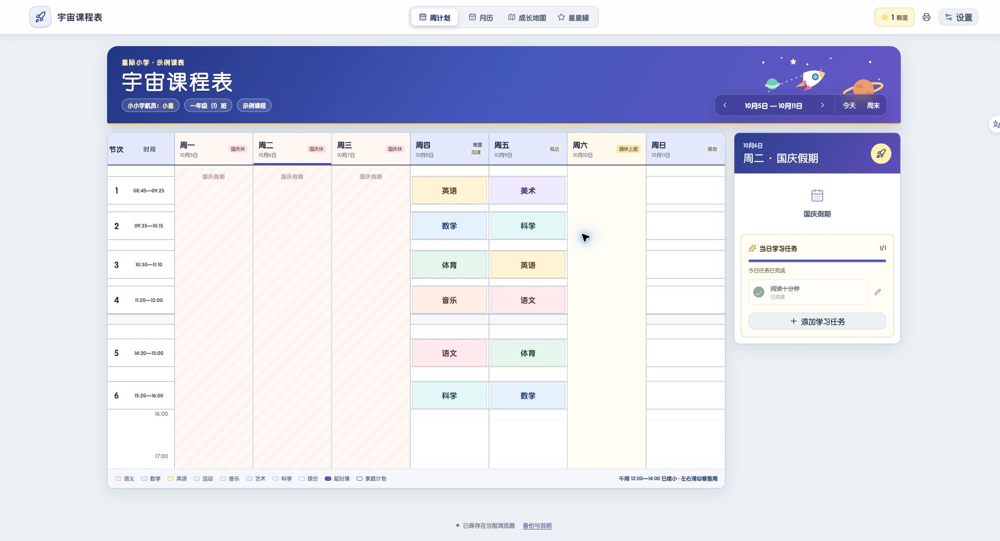

# hidearyui

Hi, dear you. 这里收录 Yui 可以公开的产品与实验。

每个产品都包含介绍、可运行源码和使用说明，按独立目录维护。

| 产品 | 用途 | 当前版本 |
| --- | --- | --- |
| [宇宙课程表](apps/cosmic-schedule/) | 家长和孩子一起安排课程、学习与周末生活 | 0.1.1 · 本地保存／自托管同步 |

## 宇宙课程表

把一周的课程、课后安排、每日学习任务与周末行程放在一起。完成任务可以收集星星，成长星图记录经典诵读进度。包含2026年国家节假日、节气、主屏幕安装及可自托管的跨设备同步。



### 下载后运行

需要 Node.js 22.13 或更高版本，建议 Node.js 24。

```sh
cd apps/cosmic-schedule
npm ci
npm run dev
```

打开终端给出的本地地址。默认保存到自己的浏览器；跨设备同步按产品说明配置自托管实例。更多功能、数据保存说明和部署方法见[产品说明](apps/cosmic-schedule/README.md)。

### 仓库结构

```text
hidearyui/
├── README.md
├── LICENSE
├── THIRD_PARTY_NOTICES.md
└── apps/
    └── cosmic-schedule/
```

后续产品各建一个 `apps/<product-name>/` 目录，沿用同样的介绍、安装与验证方式。

## 使用与授权

原创代码与素材公开供浏览和本地体验，Yui 保留全部权利。复用、改编、分发或商用请先联系作者取得授权；GitHub 平台允许的查看和 fork 按其条款执行。第三方组件遵循各自许可，见 [LICENSE](LICENSE) 与 [第三方声明](THIRD_PARTY_NOTICES.md)。

这个仓库公开源码，未授予通用开源许可。
